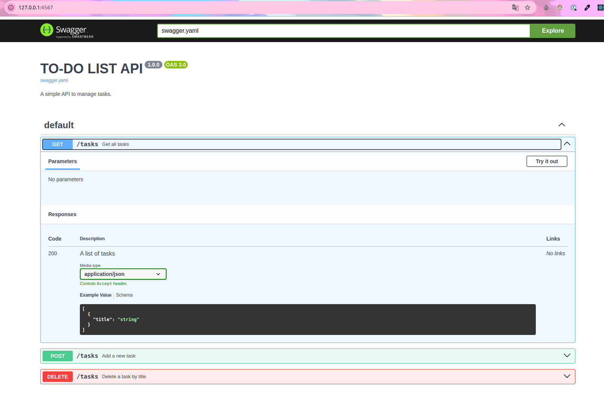

Rum `bundle`  
run `ruby app.rb`   

In browser: http://127.0.0.1:4567/

 

   

In you console:
use `curl` to interact with the API.   
exemples: 
to use get router to see all tasks 
   `curl -X GET http://127.0.0.1:4567/tasks`
